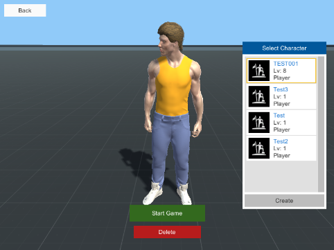
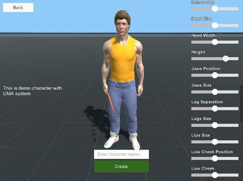
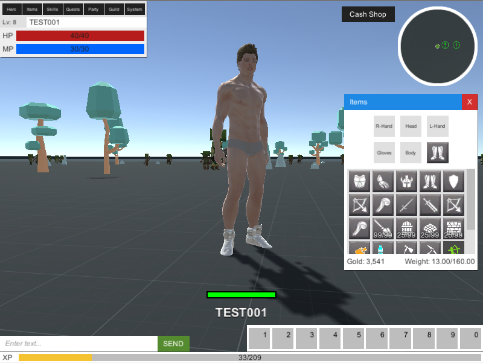
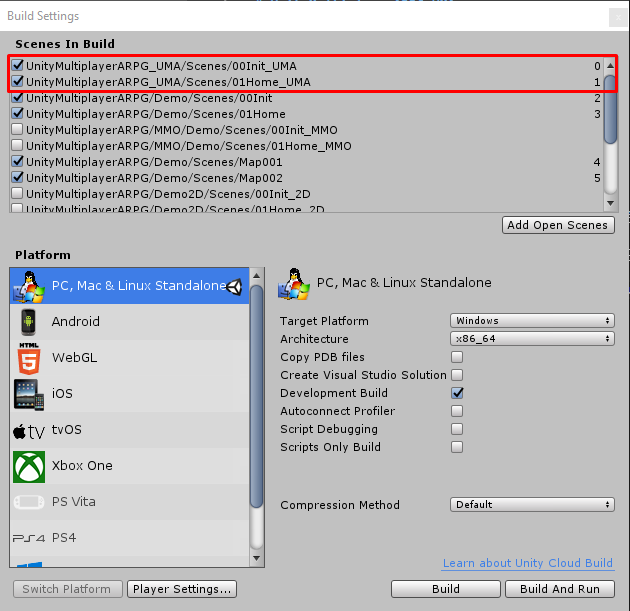
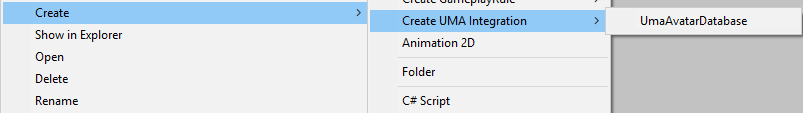
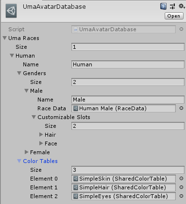

# UnityMultiplayerARPG_UMA
UMA addon for MMORPG KIT

## Getting Started

Import UMA package from https://github.com/umasteeringgroup/UMA/releases

Import addon package from https://github.com/insthync/UnityMultiplayerARPG_UMA/releases

Add `00Init_UMA` and `01Home_UMA` to `Scenes In Build`

## UMA Avatar Database

This is database for Races / Genders / Customizable Wardrobe Slots / Customizable Colors, These data will be use in create character scene

You can create this by create menu

Each entry you can set race name, from image above there is only "Human".

Then you can set `Genders` from image above there are "Male" and "Female" you have to set `Race Data`, you can learn about `Race Data` from http://umadocs.secretanorak.com/doku.php?id=knowledgebase:race, it also can set `Customizable Slots` to allow player to customize some wardrobe slots, from image above there are "Hair" and "Face", so player will able to customize character hair and face in create character scene, you can set wardrobe slots in race data

You can set `Color Tables` it is list of `Shared Color Table` which used as choice of color to let player to select when create character

## Equipment Item

For clothes / armor equipments you can set data at `Uma Race Receipe Slots` each entry you can set `Race Data` which will matching with character avatar to apply `Receipes`

For weapon you have to set `Equipment Models` which its `Equip Socket` is avatar bone name

## MMO - MySQL Database

Import `main.sql` from `SQLs` folder to your database